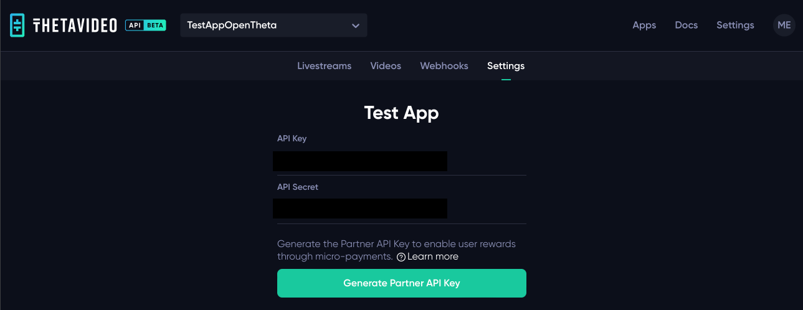

# Theta Video API Demo

In this demo, we demonstrate how to use the [Theta Video API (TVA)](https://www.thetavideoapi.com) to upload and transcode videos on the decentralized Theta Network. You can select the desired resolutions for transcoding and assign metadata tags such as video name and description. Furthermore, this example enables setting NFT Collections for Digital Rights Management (DRM).

## Getting Started

Begin by running the development server:

```bash
npm run dev
# or
yarn dev
# or
pnpm dev
```

Open [http://localhost:3000](http://localhost:3000) in your browser to access the **Theta Video API Demo App**.

## Learn More

For more information about the Theta Video API, review the following resources:

- [Documentation](https://docs.thetatoken.org/docs/theta-video-api-developer-api)
- [Website](https://www.thetavideoapi.com)

## Diving into the Code

All information related to the Theta Video API is located in `app/video.tsx`. To commence with video uploads or transcoding, you need an API Key and an API Secret from TVA. After creating an account, navigate to the Dashboard. There, you can either select an existing app or create a new one. Then, click on "Settings" above the app's name:



With these keys, you can review the videos previously created:

```typescript
axios.get(`https://api.thetavideoapi.com/video/${apiKey}/list`, {
    headers: {
        'x-tva-sa-id': apiKey,
        'x-tva-sa-secret': apiSecret,
    }
}).then((res) => {
    console.log(res.data);
}).catch((err) => {
    console.error("Error:", err);
});
```

To create a new video, decide whether to upload a new video or use an external URL where the video is hosted.

### Upload Video Using a Pre-signed URL

Initially, sign the URL:

```typescript
const resSignURL = await axios.post('https://api.thetavideoapi.com/upload', {}, {
    headers: {
        'x-tva-sa-id': apiKey,
        'x-tva-sa-secret': apiSecret
    }
});
console.log(resSignURL.data);
```

After loading the local video file, use the signed URL to upload the video from your local file directory:

```typescript
let signedURL: string = resSignURL.data.body.uploads[0].presigned_url;
await axios.put(signedURL, videoFile, {
    headers: {
        'Content-Type': 'application/octet-stream',
    }
});
```

### Transcoding a Video

There are two options here: use the video you've uploaded or a video from an external URL. The distinction lies in the source: either the ID from `resSignURL` or an external link.

```typescript
let data = {
    source_upload_id:"upload_zzzzzzzzzzzzzzzzzzzzzzzzz", // or source_uri:"link to video"
    playback_policy:"public",
    resolutions: [720, 1080],
    use_drm: true,
    drm_rules: [{
        chain_id: 361,
        nft_collection: "0x7fe9b08c759ed2591d19c0adfe2c913a17c54f0c"
    }],
    metadata:{
        name:"value",
        description:"value"
    }
}
const resTranscode = await axios.post('https://api.thetavideoapi.com/video', JSON.stringify(data), {
    headers: {
        'x-tva-sa-id': apiKeys.key,
        'x-tva-sa-secret': apiKeys.secret,
        'Content-Type': 'application/json'
    }
});
```

This section has covered a lot, but everything is configurable in our Demo App. Let's break it down:

- **resolution**: Choose one or more (360, 720, 1080, 2160).
- **use_drm**: If `drm_rules` are set, mark this as true.
- **drm_rules**: An array of objects, each containing the chain ID and the NFT collection address (Supported networks: Theta Mainnet, Theta Testnet, Ethereum Mainnet, ETH Goerli Testnet).
- **metadata**: In our example, you can define a name and description, but you can include any desired information. This metadata can be used later for filtering videos.

To check the current status of your video's encoding:

```typescript
let id: string = resTranscode.data.body.videos[0].id;
const response = await axios.get('https://api.thetavideoapi.com/video/' + id, {
    headers: {
        'x-tva-sa-id': apiKey,
        'x-tva-sa-secret': apiSecret,
    }
});
```